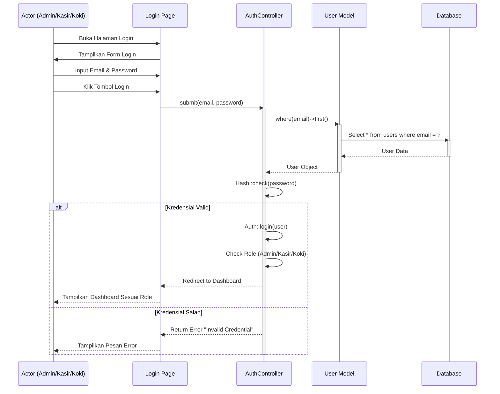
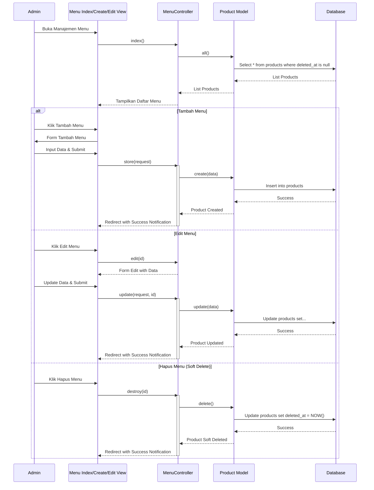
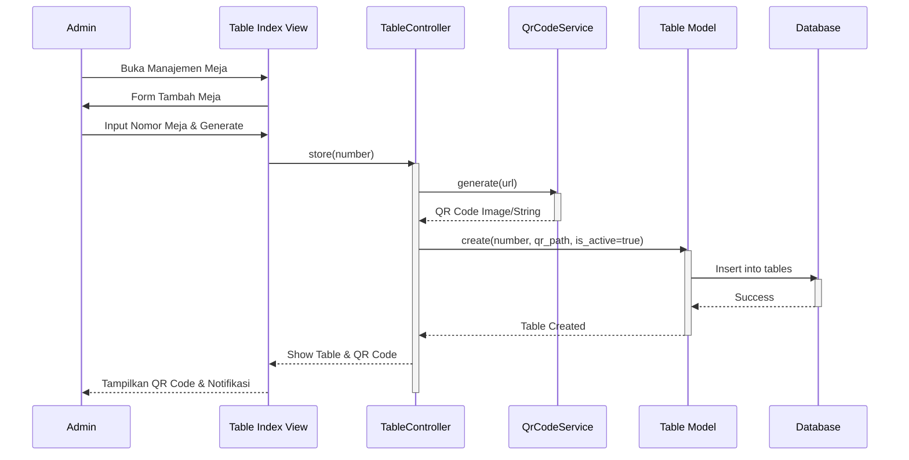
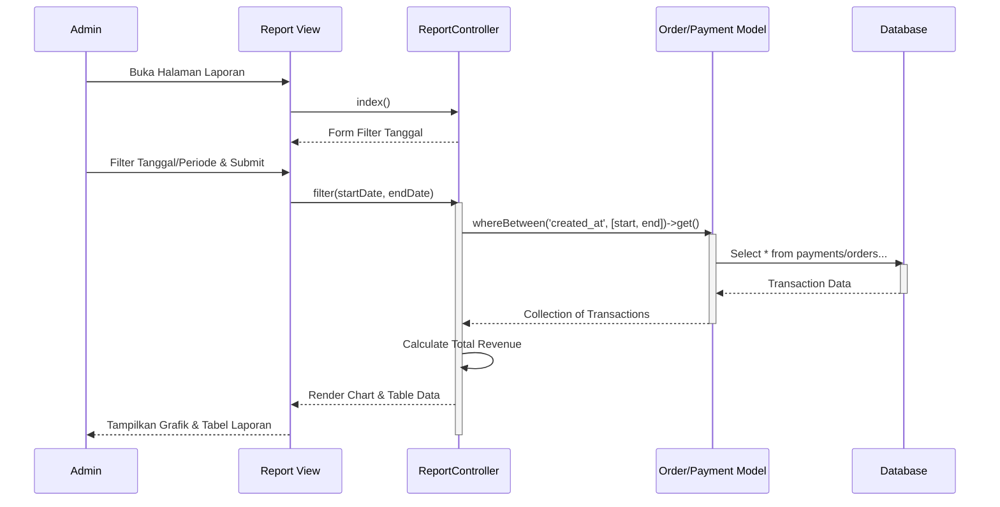
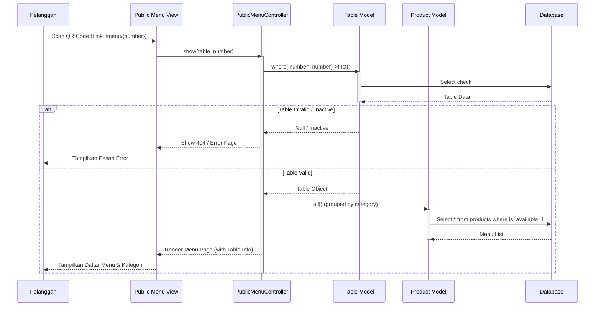
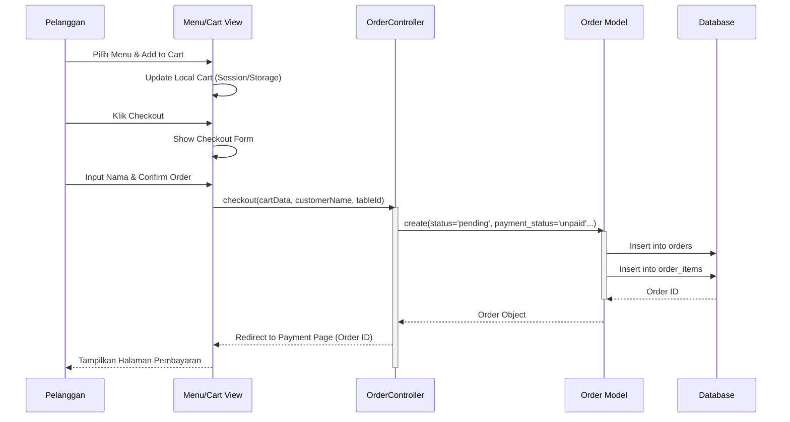
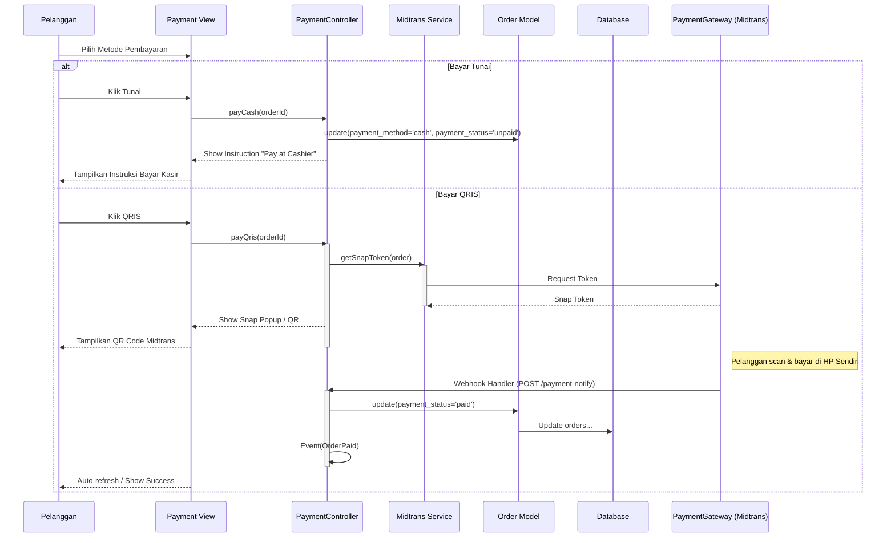
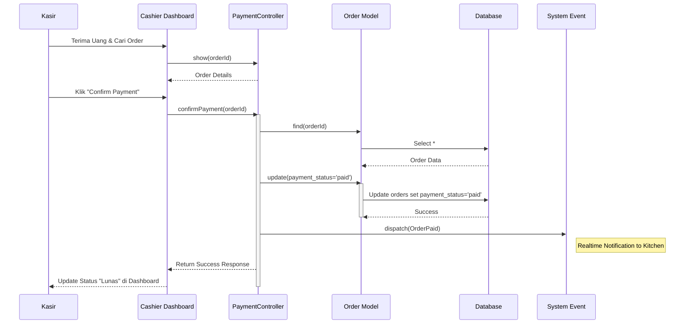
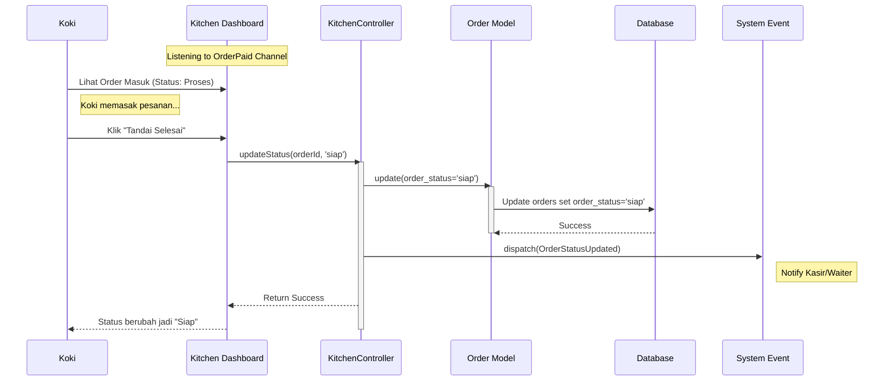

# Sequence Diagrams - RestoQR System

Dokumentasi Sequence Diagram yang diterjemahkan dari Activity Diagram yang telah disetujui.
Format: Mermaid JS.

---

## 1. Login User (Admin/Kasir/Koki)

---

## 2. Mengelola Data Menu (Admin)

---

## 3. Mengelola Data Meja (Admin)

---

## 4. Melihat Laporan (Admin)

---

## 5. Melihat Menu Digital (Pelanggan)

---

## 6. Melakukan Pemesanan (Pelanggan)

---

## 7. Melakukan Pembayaran (Pelanggan)

---

## 8. Konfirmasi Pembayaran Tunai (Kasir)

---

## 9. Update Status (Koki)

